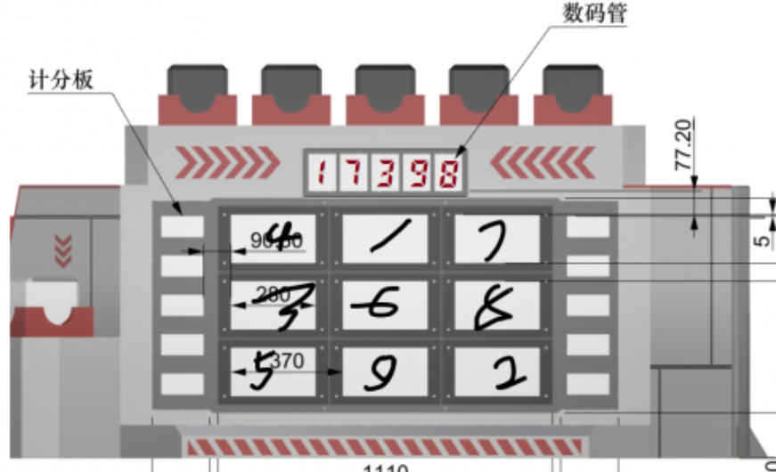

### 能量机关检测

----

比赛过程中，场地设有能量机关加成。18年为九宫格的形式。按照数目管给出的数字，依次击打屏幕上的手写数字，其中不可以有错误。能量机关激活成功后，全体车辆获得战斗力加成和防御加成。

**功能:** 检测九宫格中的目标，并输出目标位置信息给下位机

- 保证每次目标识别+打击的时间小于1.5s
- 对车身位置有较大范围的适应性

**基本原理** 

1. 二值化找出九个大的九宫格，当9个格子全部被找出后自动标定求出所有格子该旋转的角度，然后通过pnp结算旋转角度。

2. 九个格子处理完毕后再根据九个格子的位置找到数码管。根据比例关系截出完整数码管后对图像二值化，找出每一个数字位置并把每个数字截图。得到数字截图后利用穿针法识别数码管数字。

3. 根据数码管的数字再利用TensorFlow识别九宫格的手写数字然后依次击打对应九宫格。

